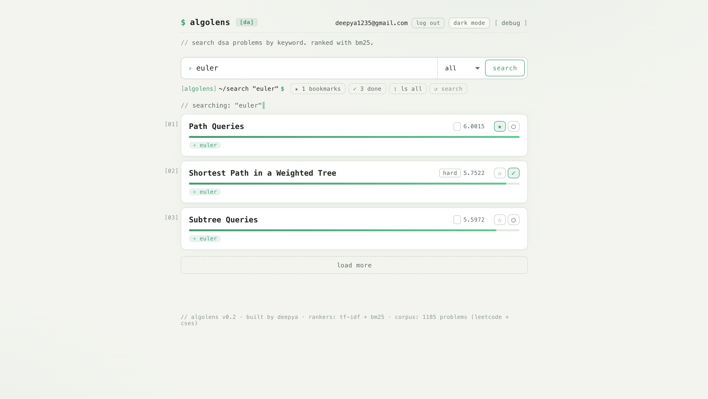
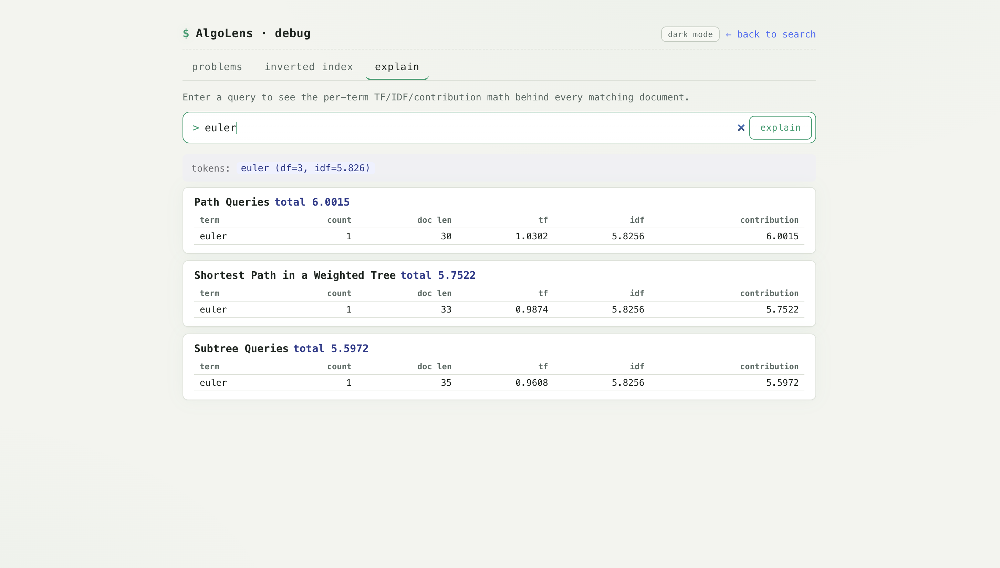
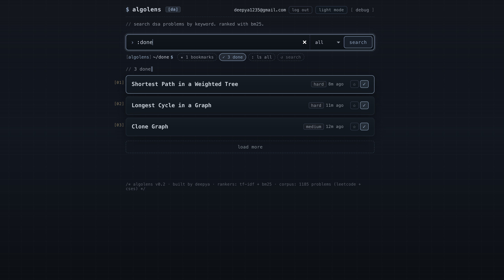

# AlgoLens

Wanted real keyword search over DSA problems. Sites filter by tags or matches problem text literally, and neither surfaces problems by the underlying solution pattern. 1,185 problems from LeetCode and CSES, indexed locally, and the search box is the whole product. Will add cf too.

I started with TF-IDF because it's the obvious first move. Tokenizer, postings, IDF, length-normalized TF. The first version worked but had a stopword bug: queries like "two sum" and "same tree" returned nothing because "two" and "same" were on the default stopword list. They're content words in DSA. Cut them.

Then built BM25 next to it. The problem TF-IDF has on this corpus is that CSES statements are long and chatty while LeetCode titles are short — so a long doc that says "graph" ten times outranks a short doc literally titled "Graph Cycle". BM25's `k1=1.5` saturates that, and `b=0.75` normalizes by document length. Same inverted index, different scoring math. MRR went from 0.73 to 0.83.

There's a debug page that opens up the math: type a query, see the per-term `tf · idf · contribution` for every matching doc. For BM25 the `tf` shown is the saturated form `(k1+1)·count / (count + k1·norm)` — capped at ~`k1+1` regardless of how often the term appears, which is the whole point.

Got numbers over a small bench— 10 hand-labeled queries, P@1, P@5, MRR, nDCG@10 (binary relevance), p50/p95 latency over 50 repeats per query.

We know the whole JS event loop thing is designed for great async IO, and for a typical backend service, IO heavy tasks, such as network and api calls. Building inverted index, and running algos like TF-IDF and BM25 is CPU-bound so thought of having a microservice for this part. TLDR, actually its better to stick to monolithic! For just 1200 odd problems, JS does a great job, and overall latency only increases because of the network overhead between the two services!

Tried to add a C++ gRPC scoring service to learn cross-language RPC. CMake, protobuf, abseil, generated header conflicts — got nowhere useful. Postmortem'd it and rewrote in Go in a fraction of the time. Same `proto/algolens.proto`, same `SearchIndex` contract. Node probes it on boot and registers it as a third ranker if reachable; routes don't know which one they're calling. Verified bit-exact parity on quality metrics. gRPC adds ~200µs of transport at this scale; server-side scoring is roughly equal to the in-memory Node ranker.

Pagination came next. Threaded `offset` and `total` through both Node rankers, the proto contract, the Go server, the gRPC client, the route, and the frontend's "load more". The interesting bit was making `total` correct after filtering, which mattered for the next thing.

Expanded the bench from 10 to 30 queries — pre-validating every relevance ID against the corpus before committing — and BM25 still wins on every metric. Gap on MRR widened from +0.10 to +0.13 once the test set got harder. Two queries flipped TF-IDF's way; the rest were BM25 wins, sometimes big ones (+0.37 on "edit distance levenshtein").

Added Postgres for users. Email + password (bcrypt + JWT in an httpOnly cookie), anonymous browsing untouched, signed-in users get bookmark and mark-as-done buttons on every result and a filter dropdown for done / not-done / all. The filter happens at the route layer post-rank, not in the index — so the Go ranker stays completely user-blind and the BM25 contract doesn't care about humans. Problem IDs are plain strings (`leetcode-two-sum`, `cses-1640`) with no FK to a problems table, which means adding Codeforces later is one config line and zero migrations. Dockerized, wired up `render.yaml` so it deploys as a single Node service plus managed Postgres on Render.

For the library view, leaned into the shell aesthetic the rest of the UI already had: type `:bookmarks` or `:done` (or click a chip on the prompt bar) and the search input becomes a command, listing your saved problems with relative timestamps instead of BM25 scores. Tab cycles between views. The path indicator (`~`, `~/done`, `~/search "graph"`) updates as you navigate.

To run it: `npm run services:start`, copy `.env.example` to `.env`, `npm install`, `npm run db:migrate`, `npm run dev`, open `http://localhost:3000`. To stop local services: `npm run services:stop`. To check them: `npm run services:status`. Implementation notes that go deeper live in `docs/implementation/`.
