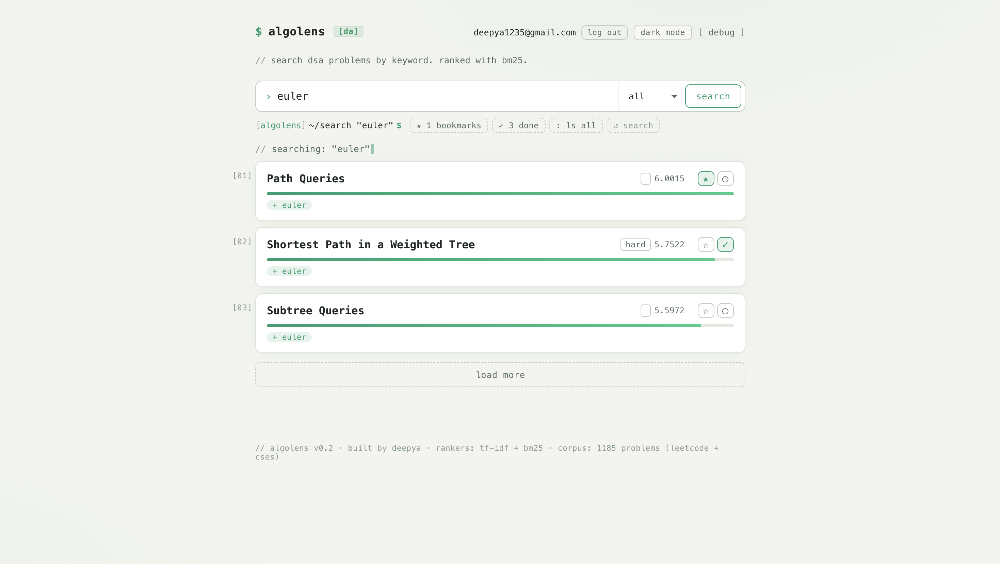
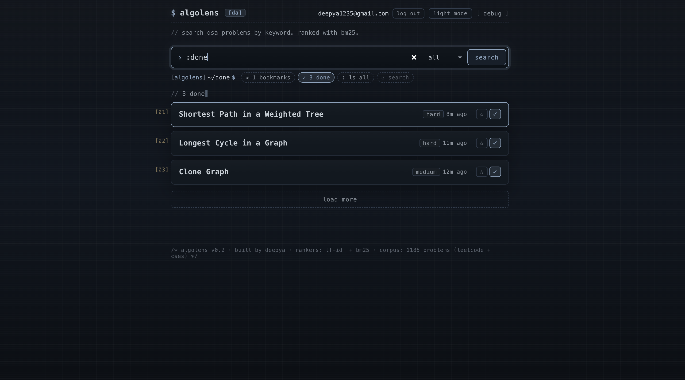
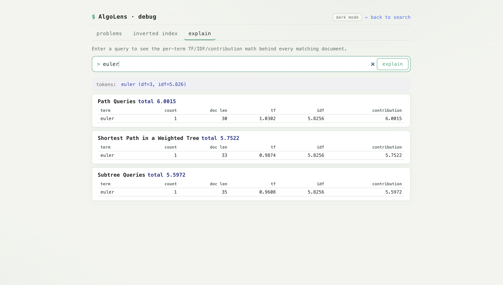

# AlgoLens

Search 1,800+ competitive-programming problems the way you actually think about them — by keyword, by describing the idea, or by technique.

Live demo: _coming — run it locally in two commands, below_

## Why this exists

Google "cses euler path" and you get the CSES homepage, a blog post, and Wikipedia — not the actual Euler-path problems. "knapsack leetcode" is no better at surfacing the good knapsack DPs. Site tags help but stop at their site's border and at coarse labels: LeetCode has `dynamic-programming`, but nothing for `digit-dp`, `wqs-binary-search`, or `slope-trick`. And nothing anywhere answers *"I remember the story — a thief robbing houses — what was that problem?"*

AlgoLens is one search box over LeetCode + CSES that handles all three.



## Finding problems

- **Three kinds of search, one box.** Keyword (`knapsack coin change` — BM25), semantic (`thief robbing houses for max money` finds House Robber — a sentence embedding bridges the vocabulary gap), or both fused (hybrid). A picker next to the search button switches modes; the status line always says which ranker answered, and how fast.
- **Technique labels deeper than "dp".** Every problem carries curated pattern labels from a ~150-slug taxonomy — `digit-dp`, `wqs-binary-search`, `slope-trick`, `booth-algorithm`. Click any label to filter results to it; browse the whole taxonomy with per-label counts on the patterns page.
- **Community names just work.** Type "aliens trick" and the query quietly expands to `wqs-binary-search` — the status line shows `+wqs binary search`, so you also learn the canonical name.
- **Find similar.** One click on any result lists its nearest neighbors by meaning (cosine over precomputed vectors, ~1 ms). Built for post-contest upsolving: open the problem that beat you, see its family.
- **Compare rankers.** A toggle runs the same query on bm25 and dense side by side — watch keyword search find nothing for "thief" while semantic nails it.
- **A deliberately hard corpus.** Every LeetCode Hard, all of CSES, and the lowest-acceptance-rate Mediums (contest Q3/Q4 grade) — no Easy filler, because the best ~1,800 hard problems beat 4,000 padded ones. Fresh contest problems flow in through one refresh command, with niche labels human-reviewed before they ship.

## Tracking the grind

- **One profile, every judge.** Save LeetCode / Codeforces / CodeChef / GitHub handles: solved counts and ratings per platform, plus one combined activity heatmap with `dsa` / `dev` / `overall` tabs — because grinding contests and shipping code are both progress.
- **Bookmarks and done-marks** on every result, with a shell-style library (`:bookmarks`, `:done`, Tab cycles views). Done-marks feed the heatmap too.



## Small things that make it nice to use

- **It's a terminal.** Monospace everything, a prompt-style path that follows you (`~/search "graph cycle"`, `~/done`, `~/profile`), a typewriter status line, light/dark themes. Type `:help` and a man page types itself out.
- **Fast on purpose.** Keyword search answers in ~0.1 ms and semantic in ~2 ms; profile revisits paint instantly from a local snapshot and refresh in the background; every view is a shareable deep link (`/?pattern=wqs-binary-search&ranker=dense`).
- **It shows its work.** Latency and ranker on every result set, query expansions made visible, a debug page exposing per-term scoring math, and a public stats page with real usage and live latency percentiles — including cold-start counts, because the free-tier instance sleeps and honesty beats mystery.



## Measured, not vibed

Every ranking decision traces to a 55-query labeled benchmark (P@k, MRR, nDCG@10, Recall@100) with keyword / paraphrase / technique slices — it's why BM25 stays the default and the fancier rankers are opt-in. The numbers and their write-ups live in [experiments/](experiments/).

## Run it

```sh
cp .env.example .env   # fill DATABASE_URL (Neon or local docker) + JWT_SECRET
npm install
npm run db:migrate
npm run dev            # http://localhost:3000
```

Corpus embeddings ship in the repo; the first boot downloads the ~25 MB embedding model once into `.model-cache/`. No database? The app still boots and searches — only accounts/bookmarks need Postgres (`npm run services:start` brings up a local one on :5433).

## More

- [docs/internals.md](docs/internals.md) — architecture, API, corpus/label workflows, deploy + release runbooks
- [docs/story.md](docs/story.md) — the build log: TF-IDF → BM25 → a failed C++ service → Go/gRPC → dense/hybrid → everything since
- [experiments/](experiments/) — benchmark results, one write-up per milestone
